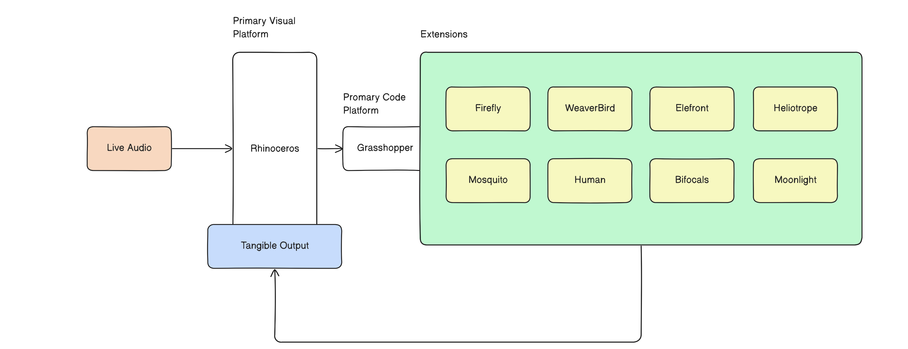

# Acoustic-Morphologies-Sound-based-Form-Generation-Through-Computation

## Project Overview

"Acoustic Morphologies: Sound-based Form Generation Through Computation " is an interdisciplinary research project that blends auditory and visual experiences through computational design. Developed at OCAD University, this project focuses on transforming sound into visual forms using a suite of software tools including Rhinoceros 3D, Grasshopper, and various extensions. The aim is to bridge the gap in sensory integration within creative contexts by capturing live audio, processing it, and converting it into digital geometries which can be 3D Printed.

## Performance Video

[https://vimeo.com/892909588?share](https://vimeo.com/892909588?share)

## Full Paper

[Project Documentation PDF](docs/Acoustic%20Morphologies.pdf).

## Author and Contact Information

- **Author:** K. Samarth Reddy
- **Institution:** OCAD University
- **Course:** DGIF – 5006 - NIME
- **Address:** 205 Richmond St W, Toronto, ON M5V 1V3
- **Email:** samarthreddy@ocadu.ca

## System Diagram

## Technical Framework

### Software Tools:

- Rhinoceros 3D
- Grasshopper 3D
- Extensions: Firefly, WeaverBird, Elefront, Heliotrope, Mosquito, Human, Bifocals, Moonlight

## Hardware Requirements:

1. Microphone for real-time audio capture.
2. Computer with adequate processing power and memory.

## Technical Expertise:

1. Knowledge in parametric and computational design principles.
2. Proficiency in audio production tools.
3. Experience with Rhino, Grasshopper, and related extensions.

## Workflow:

1. Sound Capture: Using Firefly's Sound Capture component.
2. Data Recording and Processing: Streamlining the sound data for manipulation.
3. Geometry Creation: Employing processed data to create visual geometry.
4. Geometry Manipulation: Refinement through computational operations.
5. Catmull Smoothness: Polishing the final geometry for visualization.
6. Baking Geometry: Finalizing the geometry with all attributes for further use.
7. Preparation for 3D Printing: Sorting and orienting the geometry for printing.

## Usage

To use this project:

1. Ensure all required software and plugins are installed.
2. Open the provided .3dm file in rhinoceros 7 or later
3. Open the provided .gh file in grasshopper with Rhinoceros 7 or later.
4. Connect your microphone and begin the audio capture.
5. Experiment with the parameters to explore different visual outcomes.
6. Use the button 'Bake' function to finalize and export the geometry for 3D printing or other applications.

## Applications

This project can be used for:

1. Real-time and pre-rendered audio visualizations. (Install Mosquito Extension)
2. Educational purposes in understanding the relationship between sound and visual forms.
3. Creative explorations in art and design.

## Conclusion and Future Work

This project demonstrates the potential of computational design in creating tangible art forms from auditory experiences. Future developments may include more complex applications, interactive installations, and educational tools along with forms to sound research.

## Acknowledgements

Special thanks to Professor Adam Tindale of the Faculty of Arts & Science at OCAD University for his invaluable guidance and support throughout the development of this project. His expertise and insights have been instrumental in shaping the direction and success of this project.

---

For any queries or contributions, please contact the author at samarthreddy@ocadu.ca.
